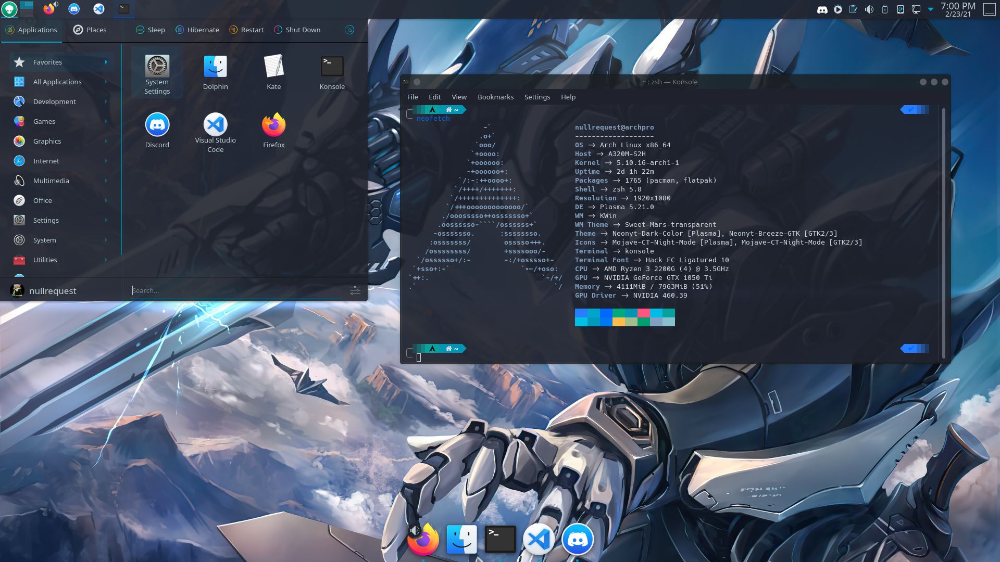

# Auto init

auto init is a python script that sets up plasma the way I like it, It also installs my zshrc, my configs for vim/neovim and finally my neofetch.conf. Auto init has 2 parts. `auto_init.py` installs everything including the plasma theme. `auto_init` will replace the username in all dotfiles so you can ignore changing them. If for whatever reason you want only a small part i.e. only the dotfiles or only the wallpaper you can use `gui.py` which uses kivy as a gui framework. feel free to use anything from this repo for whatever you want to do.

after you run this plasma should look a bit like this(latte dock and plasma 5.21 not included)

